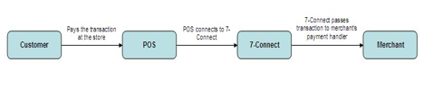

# 7-CONNECT Merchant Integration Guide

Copyright 2011, Philippine Seven Corporation and affiliates. All rights reserved.

The information contained in this document is confidential and intended for merchants who will be integrating to the 7-CONNECT gateway. Copying and distribution of this document to unauthorized parties is prohibited.

The information contained herein is subject to change without notice and is not warranted to be error-free. If you find any errors, please report them to us in writing.

## I. Overview    

Welcome to the 7-CONNECT Merchant Integration Guide.

7-CONNECT is 7-Eleven's platform for e-commerce businesses that enables cash payment convenience for your customers. Customers will be able to pay for online purchases at any 7-Eleven store.

7-CONNECT features the following:

- 24/7  cash payment at all 7-Eleven stores
- Increases your market beyond credit card holders
- Easier and faster than bank deposits
- Zero risk of fraud and chargebacks
- Real time notification of payment to your transaction systems

As a merchant, you will have access to new customers who do not have credit cards or who refuse to use them online. This opens up opportunities for you. There are no chargebacks or fraud to worry about. All completed transactions are guaranteed to be remitted to you.

## II. Getting Started

This guide assumes you have a working knowledge of the following:

- HTTP and webservice concepts
- SHA-1 hashing

Integrating your website to 7-CONNECT will require development of two points:

- 7-CONNECT Reference Request: You will need to request for a 7-CONNECT Reference which will be used by customers to pay at the store.
- Merchant Payment API: This URL will enable 7-Connect to notify your system in realtime whenever the customer pays at the store.

These URLs will be used:

  - For Testing - [https://testpay.cliqq.net/transact](https://testpay.cliqq.net/transact)
  - For Live Production - [https://pay.7-eleven.com.ph/transact](https://pay.7-eleven.com.ph/transact)

To get the latest information and graphic logos, please visit the site: [http://7-connect.philseven.com](http://7-connect.philseven.com)

## III. 7-Connect Web Services

### A. 7-Connect Reference

7-Connect Reference is a 12-digit number issued by the 7-Connect gateway. This reference number will be presented at the store in order to transact customer's purchase under 7-Connect.

#### 1. Creating a payment reference

#####**a.) Via a redirect page –** After customer checks out and chooses 7-Connect as a payment option, merchant will send a request to generate a reference number. They will be then automatically redirected to the payment instruction page. This means that merchants don't have to create a payment instruction page.  The payment instruction page contains the transaction details and the 7-Connect reference number issued for the transaction.

<br>


> <ol>
  <li> Customer selects **7-CONNECT** as Payment Mode in Checkout.</li>
  <li> Merchant Site sends a 7-CONNECT Reference Request to the 7-CONNECT Gateway.</li>
  <li> 7-CONNECT Gateway displays the following instruction page displaying the Merchant details and the 7-CONNECT Reference.  At this point, the Customer can:</li>
</ol>
<br>


 >a. Write down the 7-CONNECT Reference<br> b. Print the page
<ol start ="4">
  <li> Customer selects **Continue Browsing**.</li>
  <li> 7-CONNECT Gateway redirects to the Merchant's Success URL.</li>
  <li> Merchant Site displays the Order Confirmation page.</li>
 </ol>

######**a.1) Request Parameters**

Using HTTP Post or Get, the merchant site has to provide the 7-CONNECT Gateway with    the parameters it requires to generate a 7-CONNECT Reference.  You will be provided with your own Merchant ID and Transaction Key after completing the merchant agreement.

| Name | Data Type | Required? | Description |
| --- | --- | --- | --- |
| merchantID | Text (15) | Required | Merchant's ID as provided by 7-CONNECT |
| merchantRef | Text (40) | Required | Merchant's Reference Number |
| amount | Number (12, 2) | Required | Transaction amount.<br><br>Format: XXXXXXXXXX.XX |
| expDate | Number (14) | Optional | Transaction's expiration date/time.<br><br>Format: yyyyMMddHHmmss<br><br>If not specified, blank or malformed, the expiry date is set to the value defined in the merchant settings which is 2880 minutes. |
| successURL | Text (300) | Required | The page to which 7-CONNECT redirects to after the user clicks on the Continue Browsing button. |
| failURL | Text (300) | Required | The page to which 7-CONNECT redirects to after a failed transaction. |
| token | Text | Required | Transaction Security Token<br><br>To create this, get the SHA-1 digest of:<br>*merchantID + merchantRef + {transactionKey}*<br><br>PHP code:<br><code>*$token = sha1($merchantID . $merchantRef . '{' . $transactionKey . '}');<br><br></code>transactionKey as provided by 7-CONNECT |
| transactionDescription | Text(3000) | Optional | Will be shown in the customer LCD screen and payment instruction page (max of 3000 characters) |
| receiptRemarks | Text(660) | Optional | Will be printed in the receipt (if none, defaults to {merchantID}&#124;{merchantRef}) (max of 660 characters). Use the &#124; characters to instruct a new line.  The width of the receipt is 32 characters. Excess characters in a line will be truncated in the receipt. <br><br>Example:<br><br> "John Santos&#124;789 E. Rodriguez St.&#124;Call 777-7890 for questions&#124;Expected delivery date: 7/4/11" <br><br>This will be rendered on the receipt as:<br><br> John Santos 789 <br>E. Rodriguez St.<br>Call 777-7890 for questions<br> Expected delivery date: 7/4/11 |
| email | Text | Optional | Used for notifications from 7-CONNECT to the customer. If not provided by the merchant, a button will appear in the instruction page to allow the customer to enter their email address. |
| payLoad | Text (3000) | Optional for website only integration. **Required if service is available through CLiQQ** | This field can be set to other relevant transaction information that will be passed to the merchant's postback URL (e.g. Account Number, Customer Contact Number, etc.).<br><br>This field is needed since the 7­Connect reference number may be generated by another device. That device will generate the payLoad contents and the payLoad contents will then be passed to the merchant's postback URL upon transaction payment. <br><br>If merchant plans to integrate with CLiQQ, this will be **REQUIRED.** This will contain details of the transaction provided by the customer.|
| returnPaymentDetails | Text (1) | Optional | Value can either be Y or N or blank. If the value is Y, the gateway will include the paymentDetails when posting to the merchant postback URL when payment is made at the store.|
| | | | |

######**a.2) Sample Code**

This php code will display a form asking for a merchant reference and amount. Submitting this will display the payment instruction page containing the 7-CONNECT Reference.

transact.php
```
<?php

if (isset($\_REQUEST['submit'])) {
 $merchantRef = $\_REQUEST['merchantRef'];
 $amount = $\_REQUEST['amount'];
 
 if (!is\_numeric($amount)) {
  $errormsg = "Invalid amount.";
 }
 $transactURL = 'http://testpay.7-eleven.com.ph:8888/transact';
 $inquireURL = 'http:// testpay.7-eleven.com.ph:8888/inquire';
 $transactionKey = '628e936f45884030ac1f34bcde9c28efa6ae9c839623b45b8942bd4490e1f05d';
 $merchantID = '7-Eleven';
 $successURL = $\_SERVER['SERVER\_NAME'];
 $failURL = $\_SERVER['SERVER\_NAME'];
 $token = sha1($merchantID . $merchantRef . '{' . $transactionKey . '}');

 //set variables
 $fields = array(

    'merchantID'=>$merchantID,
    'merchantRef'=>$merchantRef,
    'amount'=>$amount,
    'successURL'=>$successURL,
    'failURL'=>$failURL,
    'token'=>$token
   );

 $params = http\_build\_query($fields);
 header("Location: $transactURL?$params");
}

if (isset($error)) {
 echo "Invalid Amount. Please enter again.";
}
?>

<h1>7-CONNECT Test Request</h1>
<form method="post">
<table>
<tr>
<td>Merchant Reference:</td>
<td><input type="text" name="merchantRef"></td>
</tr>
<tr>
<td>Amount:</td>
<td><input type="text" name="amount"></td></tr>
<tr>
<td><input type="submit" name="submit" value="Submit to 7-CONNECT"></td>
</tr>
</table>
</form>
```
<br>

#####**b). Creation of payment reference over a web service –** This allows more control on how payment instruction should be delivered to customers. Merchant will be the one responsible to display the payment instructions with the 7-Connect Reference Number. This is a web service that receives an HTTP POST request and returns a JSON response. Sends the specified data in a POST request to  the  HTTP server,  in  the  same  way  that a browser does when a user has filled in an HTML form and presses the submit button. This will cause curl to pass the data to the server using the content-type application/x-www-form-urlencoded.
<br>
######**b.1) Request Parameters**

| Name | Data Type | Required? | Description |
| --- | --- | --- | --- |
| merchantID | Text (15) | Required | Merchant's ID as provided by 7-CONNECT |
| merchantRef | Text (40) | Required | Merchant's Reference Number |
| amount | Number (12, 2) | Required | Transaction amount.<br><br>Format: XXXXXXXXXX.XX |
| expDate | Number (14) | Optional | Transaction's expiration date/time.<br><br>Format: yyyyMMddHHmmss<br><br>If not specified, blank or malformed, the expiry date is set to the value defined in the merchant settings which is 2880 minutes. |
| successURL | Text (300) | Required | The page to which 7-CONNECT redirects to after the user clicks on the Continue Browsing button. |
| failURL | Text (300) | Required | The page to which 7-CONNECT redirects to after a failed transaction. |
| token | Text | Required | Transaction Security Token<br><br>To create this, get the SHA-1 digest of:<br>*merchantID + merchantRef + {transactionKey}*<br><br>PHP code:<br><code>$token = sha1($merchantID . $merchantRef . '{' . $transactionKey . '}');</code><br><br>transactionKey as provided by 7-CONNECT |
| transactionDescription | Text(3000) | Optional | Will be shown in the customer LCD screen and payment instruction page (max of 3000 characters) |
| receiptRemarks | Text(660) | Optional | Will be printed in the receipt (if none, defaults to {merchantID}&#124;{merchantRef} (max of 660 characters). Use the pipe character to instruct a new line.  The width of the receipt is 32 characters. Excess characters in a line will be truncated in the receipt. <br><br>Example:<br><br> "John Santos&#124;789 E. Rodriguez St.&#124;Call 777-7890 for questions&#124;Expected delivery date: 7/4/11" <br><br>This will be rendered on the receipt as:<br><br> John Santos<br> 789 E. Rodriguez St.<br> Call 777-7890 for questions<br> Expected delivery date: 7/4/11|
| email | Text | Optional | Used for notifications from 7-CONNECT to the customer. If not provided by the merchant, a button will appear in the instruction page to allow the customer to enter their email address. |
| payLoad | Text (3000) | Optional for website only integration. **Required if service is available through CLiQQ** | This field can be set to other relevant transaction information that will be passed to the merchant's postback URL (e.g. Account Number, Customer Contact Number, etc.).<br><br>This field is needed since the 7­Connect reference number may be generated by another device. That device will generate the payLoad contents and the payLoad contents will then be passed to the merchant's postback URL upon transaction payment.<br><br>If merchant plans to integrate with CLiQQ, this will be **REQUIRED.** This will contain details of the transaction provided by the customer.|
| returnPaymentDetails | Text (1) | Optional | Value can either be Y or N or blank. If the value is Y, the gateway will include the paymentDetails when posting to the merchant postback URL when payment is made at the store.|
| |  |  | |

######**b.2) Response Parameters**

| Name | Data Type | Required? | Description|
| --- | --- | --- | --- |
| merchantID | Text (15) | Yes | Merchant's ID as provided by 7-Connect |
| merchantRef | Text (40) | Yes | Merchant's Reference Number |
| amount | Number (12,2) | Yes | Transaction amount.<br><br>Format: XXXXXXXXXX.XX |
| payID | Text (20) | Yes | 7-CONNECT Reference generated by the gateway |
| token | Text | Yes | Transaction Security Token<br><br>To create this, get the SHA-1 digest of:<br>*merchantID+merchantRef+payID+{transactionKey}*<br><br>PHP code:<br><code>$token = sha1($merchantID) . $merchantRef . $payID . '{'.$transactionKey . '}');</code><br><br>transactionKey as provided by 7-CONNECT|
| message | Text | No | Error Message |
| | | | |

######**b.3) Sample code**

[http://testpay.7-eleven.com.ph:8888/v1/reference/](http://testpay.7-eleven.com.ph:8888/v1/reference/)

INPUT: merchantID, merchantRef, amount, token and other optional fields in the document.

```
-d "merchantID=ATI" \
-d "merchantRef=6419705015" \
-d "amount=100" \
-d "token=235a23122139152ff830aa7fa1a876a95d4e365b" \
-d "email= [jpjamon@gmail.com](mailto:jpjamon@gmail.com)" \
-d "expDate=20140730235959" \
-d "receiptRemarks=ATI |^MerchRef: 6419705015" \
-d "returnPaymentDetails=Return payment details here." \
-d "transactionDescription=Transaction description here." \
-d "payLoad=payLoad." \
```

OUTPUT: payID, merchantID, merchantRef, amount, expiryDate, token, message

```
curl \
-d "merchantID=ATI" \
-d "merchantRef=6419705015" \
-d "amount=100" \
-d "token=235a23122139152ff830aa7fa1a876a95d4e365b" \
-d "email= [jpjamon@gmail.com](mailto:jpjamon@gmail.com)" \
-d "expDate=20140730235959" \
-d "receiptRemarks=ATI |MerchRef: 6419705015" \
-d "returnPaymentDetails=Return payment details here." \
-d "transactionDescription=Transaction description here." \
-d "payLoad=payLoad." \
```

## IV. Merchant Web Services

### A. Handling Payments

Merchants should prepare a Payment Handler to process payment postings that were paid at the store. Once payment was confirmed, merchant can now proceed to fulfill the customer's order such as redeem a voucher, receive an e-ticket or confirm a booking.


 
7-CONNECT requires its merchants to have the following web services:

> VALIDATE (mandatory)

This is used to verify the validity of a given Merchant Reference Number.

> CONFIRM (mandatory)

This is used to void the payment made to a given Merchant Reference Number.
<br>
<br>
Communication will be done using **HTTP Post**.
<br>
<br>
####**1. Request Parameters**

| Name | Data Type | Required? | Description |
| --- | --- | --- | --- |
| type | Text | Yes | Valid values: VALIDATE, CONFIRM |
| merchantRef | Text (40) | Yes | Merchant's Reference Number |
| amount | Number (12, 2) | Yes | Transaction Amount<br><br>Format: XXXXXXXXXX.XX |
| token | Text | Yes | Transaction Security Token<br><br>To create this, get the SHA-1 digest of:<br><br>*type +merchantID + merchantRef + {transactionKey}*<br><br>transactionKey as provided by 7-CONNECT |
| payLoad | Text (3000) | Optional | If no value was passed during the 7­Connect reference generation, then this parameter will not be passed to the postback URL.<br><br>This field will contain the value of the payLoad request parameter when the 7­Connect reference number was generated. |
| paymentDetails | Text | Optional | Merchant will specify if they will require payment details. If 'N' or no value was passed to the parameter returnPaymentDetails during the 7­Connect reference generation, then this parameter will not be passed to the postback URL.<br><br>This field is the JSON­formatted string containing payment details formatted this way:<br><code>{"payID":"9913-0850-0305", "store":"0189", "pos":"1", "shift":"1", "bdate":"20130312000000"}</code> |
| | | | |

####**2. Response Parameters**

| Name | Data Type | Required? | Description |
| --- | --- | --- | --- |
| type | Text | Yes | Valid values: VALIDATE, CONFIRM |
| merchantRef | Text (40) | Yes | Merchant's Reference Number |
| amount | Number (12, 2) | Yes | Transaction Amount<br><br>Format: XXXXXXXXXX.XX |
| authCode | Text (20) | Yes, except for Validate | Merchant-system-generated Authorization Code |
| responseCode | Text (12) | Yes | Valid values: SUCCESS, DECLINED |
| responseDesc | Text (40) | No | Details for the success or declined transaction. |
| remarks | Text (160) | No | Any remarks from the Merchant.  This will be printed on the receipt. |
| token | Text | Yes | Transaction Security Token<br><br>To create this, get the SHA-1 digest of:<br>*type + merchantID + merchantRef + authCode + responseCode + {transactionKey}*<br><br>transactionKey as provided by 7-CONNECT |
| | | | |

The format is :

```
?type=CONFIRM&merchantID=merchantID\_value&merchantRef=merchantRef\_value&amount=amount\_value&authCode=authCode\_value&responseCode=responseCode\_value&responseDesc=responseDesc\_value&token=token\_value
```

Samples are :

For DECLINED :

```
?type=CONFIRM&merchantID=testmerchant&merchantRef=&amount=&authCode=&responseCode=DECLINED&responseDesc=DONT LEAVE ANY FIELDS BLANK&token=fe1047606531ebdbe00d1786c80c3ca7e54ce79a
```

For SUCCESS :

```
?type=CONFIRM&merchantID=testmerchant&merchantRef=testmerchant01&amount=2500&authCode=1040249589&responseCode=SUCCESS&responseDesc=SUCCESSFUL&token=7a1b6c2212e92b2ba1a2ba2d7db4031a93086d0c
```

**3. Sample Code**

The following php code implements the merchant service that will handle VALIDATE and CONFIRM instructions coming from the 7-CONNECT gateway.

```
<?php

/* This is the verification service that listens to payment transactions from the gateway. */

if (isset($\_REQUEST['type'])) {
 $transactiontype = $\_REQUEST['type'];
 $merchantRef = $\_REQUEST['merchantRef'];
 $amount = $\_REQUEST['amount'];
 $token = $\_REQUEST['token'];

 // Check if token is valid
 // Replace merchantID with your merchant ID
 $transactionKey = '7ede208b7f8a58573057e7dde57fe8f3969fe0b2c32149c36b8c29ae9f744274';
 $merchantID = 'TestMerchant01';
 $validtoken = sha1($transactiontype . $merchantID . $merchantRef . '{' . $transactionKey . '}');
 
  if ($token != $validtoken) {
  $authCode = "";
  $responseCode = "DECLINED";
  $responseDesc = "Invalid token";
 } else {
  $authCode = '1111';
  $responseCode = "SUCCESS";
  $responseDesc = "";
  switch($transactiontype) {
   case "VALIDATE":
    // Check if merchantRef is still valid
    break;
   case "CONFIRM":
    // Update the paid status of the table
    break;
   default:
    $responseCode = "DECLINED";
    $responseDesc = "Unknown transaction type";
  }
 }

 $token = sha1($transactiontype . $merchantID . $merchantRef . $authCode . $responseCode . '{' . $transactionKey . '}');

 //set GET variables
 $fields = array(
    'merchantID'=>$merchantID,
    'merchantRef'=>$merchantRef,
    'amount'=>$amount,
    'authCode'=>$authCode,
    'responseCode'=>$responseCode,
    'responseDesc'=>$responseDesc,
    'token'=>$token
   );

 $params = http\_build\_query($fields);
 //output response
 echo "?$params";

 //write logfile
 $myFile = "/tmp/7-CONNECT.log";
 $fh = fopen($myFile, 'a') or exit();
 fwrite($fh, date('Y-m-d H:i ') . $params . "\n");
 fclose($fh);
}
```

## V. Transaction Inquiry

###A. Request Parameters

Using HTTP Post or Get, the merchant site has to provide the 7-CONNECT Gateway with the parameters it requires for transaction inquiry.  These are:

| Name | Data Type | Required? | Description |
| --- | --- | --- | --- |
| merchantID | Text (15) | Yes | Merchant's ID as provided by 7-CONNECT |
| merchantRef | Text (40) | Yes | Merchant's Reference Number |
| token | Text | Yes | Transaction Security Token<br><br>To create this, get the SHA-1 digest of:<br>*merchantRef + {transactionKey}*<br><br>transactionKey as provided by 7-CONNECT |
| | | | |

###B. Response Parameters

7-CONNECT returns a JSON-formatted string. Example response:
```
{ "merchantID": "123", "merchantRef": "123", "payID": "123", "status": "UNPAID", "token": "123" }
```

| Name | Data Type | Required? | Description |
| --- | --- | --- | --- |
| merchantID | Text (15) | Yes | Merchant's ID as provided by 7-CONNECT |
| merchantRef | Text (40) | Yes | Merchant's Reference Number. If the merchant reference number is not unique, the gateway will return the first match. |
| payID | Text (20) | Yes | 7-CONNECT Reference generated by the gateway |
| status | Text | Yes | Valid values: UNPAID, PAID, POSTED, EXPIRED, ERROR |
| token | Text | Yes | Transaction Security Token<br><br>To create this, get the SHA-1 digest of:<br>*merchantRef + payID + status + {transactionKey}*<br><br>transactionKey as provided by 7-CONNECT |
| message | Text | No | A description of the response |
| | | | |

## VI. APPENDIX

### Revision History

| Version | Date | Revisions |
| --- | --- | --- |
| 0.1 | 2011-03-02 | Initial document draft |
| 0.2 | 2011-03-16 | Added test plan section |
| 0.3 | 2011-03-18 | Added screenshots. Renamed 7-Pay ID to 7-Pay Reference. |
| 0.4 | 2011-03-24 | Added documentation on generating the token.<br><br>Also added sample php code for getting the 7-Pay Reference. |
| 0.5 | 2011-04-06 | Added 3 new optional fields (transactionDescription - will be shown in the customer LCD screen and payment instruction page, receiptRemarks that is printed in the receipt, and email for notifying customers of 7-Pay transactions.<br><br>Also added sample code for merchant web service implementation. |
| 0.6 | 2011-04-26 | Modified branding to 7-CONNECT. |
| 0.7 | 2011-07-26 | Updated the instruction page screenshot to include the "Email instructions to …" button.(2.1)<br><br>Changed receipt remarks maximum limit to 660 characters and added an example.(2.1.2)<br><br>Corrected URL of test environment.(2.1.4)<br><br>Added a merchant ID parameter to the transaction inquiry (2.2 and 2.2.3) and modified the return values directly in JSON format. The previous API has been deprecated. |
| 0.8 | 2013-01-04 | Increased character limit of transactionDescription to 3,000 from 128 characters. |
| 0.9 | 2013-10-07 | Added payLoad and returnPaymentDetails in the calling parameters. |
| 1.1 | 2014-08-04 | Added REST style createReference service |
| 1.2 | 2015-03-20 | Split introduction to "Overview" and "Getting Started"<br><br>Added subtopic in creating payment reference<br><br>Added required payload parameter for CLiQQ<br><br>"Response Parameter" changed to "Parameters sent to SuccessURL or FailURL"<br><br>Added description for Handling Payments<br><br>URLs included in "Getting Started" Topic<br><br>Added CLiQQ Parameters |

### Parameters sent to SuccessURL or FailURL

These are the parameters that will be sent depending on whether the 7-CONNECT Request was successful or not.  The parameters are:

| Name | Data Type | Required? | Description |
| --- | --- | --- | --- |
| merchantID | Text (15) | Yes | Merchant's ID as provided by 7-CONNECT |
| merchantRef | Text (40) | Yes | Merchant's Reference Number |
| amount | Number (12, 2) | Yes | Transaction amount.<br><br>Format: XXXXXXXXXX.XX |
| payID | Text (20) | Yes | 7-CONNECT Reference generated by the gateway |
| token | Text | Yes | Transaction Security Token<br><br>To create this, get the SHA-1 digest of:<br>*merchantID + merchantRef + payID + {transactionKey}*<br><br>PHP code:<br><code>$token = sha1($merchantID . $merchantRef . $payID . '{' . $transactionKey . '}');</code><br><br>transactionKey as provided by 7-CONNECT |
| message | Text | No | Error message. |
| | | | |

### CLiQQ

CLiQQ allows customers to make a transaction by just entering the needed information the merchant requires at the CLiQQ kiosk or CLiQQ mobile app. Once customer makes the transaction using CLiQQ kiosk or app, CLiQQ will dispense a payment slip containing a 7-Connect Reference number to be presented when paying at the counter.

#### Process Flow

#####**Request Parameters**

The merchant should expect the following variables which will be passed via HTTP POST (with the parameters in the request content, not in the URL). Please refer to the section IV-A on handling payments. The CLiQQ service mandates the use of payload and paymentDetails to return transaction information that is entered by the customer at the kiosk or mobile app. The following describes the data that is sent to the merchant upon payment at the counter.

| Variable Name | Data Type | Description |
| --- | --- | --- |
| type | Text | CONFIRM |
| merchantRef | Text (40) | (merchant to require us of the value) |
| amount | Number (12,2) | Transaction amount  |
| payLoad | Text | JSON-formatted string containing other relevant transaction information<br><br>**LOAD**<br>Ex. Mobile number<br><br>**E-PIN**<br>Ex. Mobile number<br><br>**BILLS PAYMENT**<br>First Field name<br>>Ex. Account Number<br><br>Second Field name<br>>Ex. Subscriber's Name<br><br>It will be formatted this way:<br>Sample for load and e-pins:<br>```{"mobilenumber":"09228792165"}```<br><br>Sample for bills payment:<br>```{"account": "0708535737", "subscriber": "JDELACRUZ", }```</br>|
| paymentDetails | Text | JSON-formatted string containing payment details. The merchant can expect the data to be formatted this way:<br>{"payID":"<7-Connect Reference Number>", "store":"<Store Number>", "pos":"<POS Number>", "shift":"<Shift Number>", "bdate":"<Business Date>"}<br><br>Example:<br><code>{"payID":"1500-1001-1002", "store":"1234", "pos":"2", "shift":"1", "bdate":"2015-02-03 06:54:04 PHT"}</code>|
| token | Text | Transaction Security Token This value must match the **SHA-1 digest** of:  type +merchantID + merchantRef + {transactionKey} where:<br><br>type - the value of the type variable<br>merchantID - provided by 7-Connect<br>merchantRef - the value of the merchantRef variable<br>transactionKey  - provided by 7-Connect<br><br>Example:<br>SHA-1 digest of:<br><code>CONFIRMtestmerchanttestmerchant003{628e936f45884030ac1f34bcde9c28efa6ae9c839623b45b8942bd4490e1f05d}</code><br> = **f46c33a0e2f35cb2321a4054ec2750f38a8f7a25** |
| | | |

#### Response Variable

In order to allow 7-Connect to confirm that the merchant has acknowledged the payment notification, the payment handler service must contain the following variables:

| Variable Name | Data Type | Description |
| --- | --- | --- |
| type | Text | CONFIRM |
| merchantRef | Text (40) | (merchant to require the value) |
| amount | Number (12,2) | Transaction amount |
| authCode | Text (20) | Merchant-system-generated Authorization Code |
| responseCode | Text (12) | Valid values: SUCCESS, DECLINED |
| responseDesc | Text (40) | Brief description for the response code |
| remarks | Text (160) | Any remarks from the Merchant.  This will be printed on the receipt. |
| token | Text | Transaction Security Token<br><br>This value must match the SHA-1 digest of:<br><br>*type +merchantID + merchantRef + authCode + responseCode + {transactionKey}* where:<br><br>type - the value of the type variable<br>merchantID - provided by 7-Connect<br>merchantRef - the value of the merchantRef variable<br>authCode - the authCode generated by the merchant<br>responseCode - the responseCode generated by the merchant<br>transactionKey  - provided by 7-Connect<br><br>Example:<br>SHA-1 digest of:<br><code>CONFIRM + Kiosk\_BillsPayment +837143358+ B30F3454191E + SUCCESS + {197f13e7ce767852ea56d15d8b3af9decb5c642be2dc7e5d09d588ce5b0b3590}</code><br>**=  9a96ebd5c4ef2b1d9b82fde2bb4a2d70dbbc0717** |

The payment listener should output response a simple text containing a question mark(?) along with the url encoded variables and its respected values:

The format is :
```
?merchantID=merchantID\_value&merchantRef=merchantRef\_value&amount=amount\_value&authCode=authCode\_value&responseCode=responseCode\_value&responseDesc=responseDesc\_value&token=token\_value
```
Samples are :

For DECLINED :
```
?merchantID=kioskload&merchantRef=&amount=&authCode=&responseCode=DECLINED&responseDesc=DONT LEAVE ANY FIELDS BLANK&token=fe1047606531ebdbe00d1786c80c3ca7e54ce79a
```
For SUCCESS :
```
?merchantID=kioskload&merchantRef=topup01&amount=2500&authCode=1040249589&responseCode=SUCCESS&responseDesc=SUCCESSFUL&token=7a1b6c2212e92b2ba1a2ba2d7db4031a93086d0c
```
